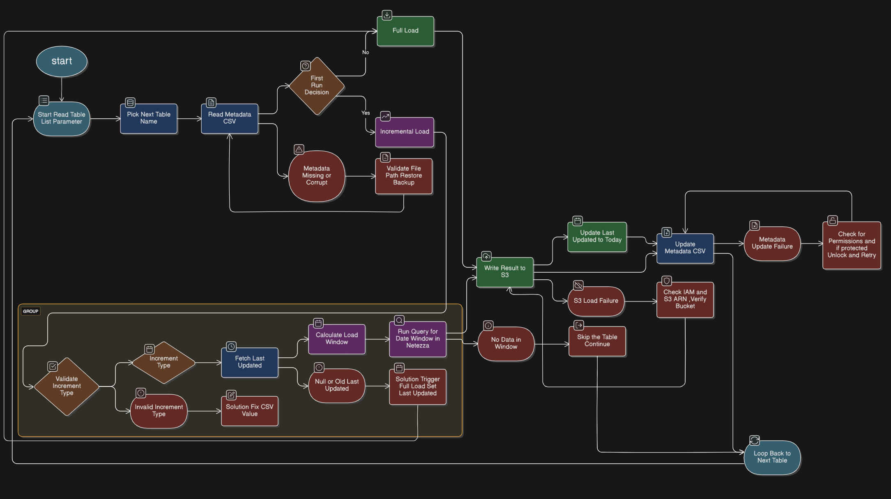

# Netezza to AWS Migration for Incremental Jobs

## Project Overview

This project provides a robust, automated pipeline to migrate data from IBM Netezza (a high-performance data warehouse) to Amazon Web Services (AWS), specifically to Amazon S3. The pipeline supports both full and incremental data loads, uses metadata to track progress, and includes error handling and recovery mechanisms. It is suitable for ongoing data migration and synchronization in enterprise environments.

---

## Key Concepts and Terminology

### What is Netezza?
**Netezza** is a high-performance data warehouse appliance developed by IBM. It is used by organizations to store, manage, and analyze large amounts of structured data. Netezza is known for its fast query performance and is often used for business intelligence and analytics workloads.

### What is AWS?
**Amazon Web Services (AWS)** is a cloud computing platform that provides a wide range of services, including storage, databases, analytics, and more. In this pipeline, AWS is used as the destination for storing and processing data that is migrated from Netezza.

### What is S3?
**Amazon S3 (Simple Storage Service)** is a scalable object storage service provided by AWS. It is used to store data files, such as the results of data extraction from Netezza, in a secure and durable way.

### What is a Full Load?
A **Full Load** means copying all the data from a source table in Netezza to AWS, regardless of whether the data has changed since the last migration. This is usually done the first time a table is migrated, or if there is a need to completely refresh the data in AWS.

### What is an Incremental Load?
An **Incremental Load** means only copying new or changed data from Netezza to AWS since the last successful migration. This approach saves time and resources by avoiding the transfer of unchanged data.


### What is Metadata?
**Metadata** is data about data. In this pipeline, metadata is stored in a CSV file and includes information such as:
- The last time each table was updated
- The type of incremental load to use
- Other parameters needed for the migration process

---

## ETL Script Example

Below is a sample ETL script used for migrating data from Netezza to AWS Redshift using the metadata CSV:

```python
import csv
import datetime

# Simulated extract from Netezza (replace with actual DB connection in production)
def extract_data(table, columns):
  print(f"Extracting data from {table} for columns: {columns}")
  # Simulated data
  return [
    {col: f"sample_{col}_value" for col in columns}
    for _ in range(3)
  ]

# Simulated transform (add your logic here)
def transform_data(data):
  print("Transforming data...")
  # Example: Add a processed timestamp
  for row in data:
    row['processed_at'] = datetime.datetime.now().isoformat()
  return data

# Simulated load to AWS Redshift (replace with actual Redshift connection in production)
def load_data(table, data):
  print(f"Loading data into {table}...")
  for row in data:
    print(row)

# Read metadata from CSV
def read_metadata(metadata_file):
  metadata = {}
  with open(metadata_file, newline='') as csvfile:
    reader = csv.DictReader(csvfile)
    for row in reader:
      key = (row['source_table'], row['target_table'])
      if key not in metadata:
        metadata[key] = []
      metadata[key].append(row)
  return metadata

def main():
  metadata_file = 'sample_metadata.csv'
  metadata = read_metadata(metadata_file)
  for (source_table, target_table), columns_info in metadata.items():
    columns = [col['column_name'] for col in columns_info]
    data = extract_data(source_table, columns)
    data = transform_data(data)
    load_data(target_table, data)

if __name__ == "__main__":
  main()
```

---

## Function Explanations

### `extract_data(table, columns)`
```python
def extract_data(table, columns):
  print(f"Extracting data from {table} for columns: {columns}")
  # Simulated data
  return [
    {col: f"sample_{col}_value" for col in columns}
    for _ in range(3)
  ]
```
**Purpose:** Simulates extracting data from a Netezza table for the specified columns. In a real scenario, this would connect to the Netezza database and fetch the data.

---

### `transform_data(data)`
```python
def transform_data(data):
  print("Transforming data...")
  # Example: Add a processed timestamp
  for row in data:
    row['processed_at'] = datetime.datetime.now().isoformat()
  return data
```
**Purpose:** Simulates transforming the extracted data. Here, it adds a processed timestamp to each row. You can add more transformation logic as needed.

---

### `load_data(table, data)`
```python
def load_data(table, data):
  print(f"Loading data into {table}...")
  for row in data:
    print(row)
```
**Purpose:** Simulates loading the transformed data into an AWS Redshift table. In a real scenario, this would connect to Redshift and insert the data.

---

### `read_metadata(metadata_file)`
```python
def read_metadata(metadata_file):
  metadata = {}
  with open(metadata_file, newline='') as csvfile:
    reader = csv.DictReader(csvfile)
    for row in reader:
      key = (row['source_table'], row['target_table'])
      if key not in metadata:
        metadata[key] = []
      metadata[key].append(row)
  return metadata
```
**Purpose:** Reads the metadata CSV file and organizes it by source and target tables. This metadata guides the ETL process.

---

### `main()`
```python
def main():
  metadata_file = 'sample_metadata.csv'
  metadata = read_metadata(metadata_file)
  for (source_table, target_table), columns_info in metadata.items():
    columns = [col['column_name'] for col in columns_info]
    data = extract_data(source_table, columns)
    data = transform_data(data)
    load_data(target_table, data)
```
**Purpose:** Orchestrates the ETL process by reading metadata, extracting, transforming, and loading data for each table defined in the metadata file.

---

---

## Pipeline Architecture



---

## Step-by-Step Pipeline Flow

### 1. Initialization
- **Start Read Table List Parameter:**  
  The pipeline starts by reading a list of tables that need to be migrated. This list is usually provided as a parameter or configuration file.

### 2. Table Processing Loop
- **Pick Next Table Name:**  
  The pipeline selects the next table from the list to process.
- **Read Metadata CSV:**  
  For the selected table, the pipeline reads its metadata from a CSV file. This metadata tells the pipeline when the table was last updated and what type of load (full or incremental) should be performed.

#### Error Handling:
If the metadata is missing or corrupt, the pipeline logs an error and skips processing for that table.

### 3. First Run Decision
- **First Run Decision:**  
  The pipeline checks if this is the first time the table is being migrated.
  - **No:** If not the first run, a full load is performed.
  - **Yes:** If it is the first run, an incremental load is performed (if possible).

---

## Full Load Path
- **Full Load:**  
  All data from the table in Netezza is copied to AWS S3. This is a complete refresh of the table in the cloud.

---

## Incremental Load Path
- **Incremental Load:**  
  Only new or changed data since the last update is copied from Netezza to AWS S3.
- **Validate File Path Restore Backup:**  
  The pipeline checks that backup and restore file paths are valid, ensuring that data can be recovered if needed.

#### Incremental Load Sub-Process
- **Validate Increment Type:**  
  The pipeline checks if the increment type (such as date-based or ID-based) specified in the metadata is valid.
  - **Invalid Increment Type:**  
    If the increment type is invalid, the pipeline logs an error and tries to fix the value in the metadata CSV.
- **Fetch Last Updated:**  
  The pipeline retrieves the last updated timestamp for the table from the metadata. This tells the pipeline where to start looking for new or changed data.
- **Calculate Load Window:**  
  The pipeline calculates the time window for which data should be extracted (for example, all data since the last update).
  - **Null or Old Last Updated:**  
    If the last updated value is missing or very old, the pipeline may trigger a full load instead.
- **Run Query for Date Window in Netezza:**  
  The pipeline runs a query in Netezza to extract only the data that falls within the calculated window.
  - **No Data in Window:**  
    If no new data is found, the pipeline skips this table and moves to the next one.

---

## Data Load to AWS
- **Write Result to S3:**  
  The extracted data is written to an S3 bucket in AWS.
  - **S3 Load Failure:**  
    If the data cannot be written to S3 (for example, due to permission issues), the pipeline checks AWS IAM permissions and verifies the S3 bucket settings.
    - **Skip the Table Continue:**  
      If the issue cannot be fixed, the pipeline skips this table and continues with the next one.

---

## Metadata Update
- **Update Last Updated to Today:**  
  After a successful load, the pipeline updates the metadata to record the current date as the last update time for the table.
- **Update Metadata CSV:**  
  The metadata CSV file is updated to reflect the new state of the table.
  - **Metadata Update Failure:**  
    If the metadata file cannot be updated (for example, if it is locked or protected), the pipeline checks file permissions and tries to unlock and update the file again.

---

## Loop and Completion
- **Loop Back to Next Table:**  
  The pipeline repeats the process for the next table in the list until all tables have been processed.

---

## Error Handling and Recovery
- The pipeline includes robust error handling at each step:
  - Metadata issues (missing/corrupt)
  - Invalid increment types
  - S3 load failures (with IAM and bucket verification)
  - Metadata update failures (with permission checks and retries)
- Tables with unrecoverable errors are skipped, and the process continues with the next table.

---

## How to Recreate This Pipeline (Step-by-Step)

Below are the steps and resources needed to set up this Netezza-to-AWS migration pipeline from scratch:

### 1. Prerequisites
- **Netezza Database Access**: Credentials and network access to your Netezza data warehouse.
- **AWS Account**: With permissions to create and manage S3 buckets, IAM roles, and (optionally) AWS Glue or Lambda.
- **Python Environment**: (or other ETL tool/language as per your implementation)
- **Metadata CSV Template**: A CSV file to track table names, last updated timestamps, and increment types.

### 2. AWS Resource Setup
1. **Create an S3 Bucket**
   - Example name: `netezza-migration-bucket`
   - This will store all extracted data files from Netezza.
2. **Create IAM Role/User**
   - Grant permissions for S3 (read/write), and optionally for Lambda/Glue if using serverless ETL.
   - Example role name: `NetezzaMigrationRole`
3. *(Optional)* **Set Up AWS Glue or Lambda**
   - For serverless ETL, create Glue jobs or Lambda functions to automate the process.

### 3. Prepare Metadata CSV
- Create a CSV file (e.g., `migration_metadata.csv`) with columns like:
  - `table_name`, `last_updated`, `increment_type`, etc.
- Store this file in a location accessible to your ETL scripts.

### 4. Develop or Configure the ETL Script/Tool
1. **Connect to Netezza**
   - Use ODBC/JDBC or a Python library (e.g., `pyodbc`) to connect and run queries.
2. **Read Table List and Metadata**
   - Read the list of tables to migrate and their metadata from the CSV.
3. **Implement Full and Incremental Load Logic**
   - For each table, decide whether to do a full or incremental load based on metadata.
   - Extract data from Netezza using SQL queries.
4. **Write Data to S3**
   - Save extracted data as CSV, Parquet, or another format in your S3 bucket.
5. **Update Metadata**
   - After successful load, update the metadata CSV with the new `last_updated` value.
6. **Error Handling**
   - Log errors, handle missing/corrupt metadata, and skip tables as needed.

### 5. Automation (Optional)
- Schedule the ETL script using cron, Windows Task Scheduler, or AWS services (e.g., Lambda, Glue, Step Functions).

### 6. Resource Names Used in Example
- **S3 Bucket**: `netezza-migration-bucket`
- **IAM Role**: `NetezzaMigrationRole`
- **Metadata CSV**: `migration_metadata.csv`

---

By following these steps and using the resource names above (or your own), you can recreate the Netezza-to-AWS migration pipeline in your own environment. Adjust the script/tooling as needed for your specific requirements and security policies.

---

## Metadata CSV: Before and After Processing

### Before Processing
The metadata CSV (e.g., `sample_metadata.csv`) contains information about each table and column to be migrated. Here is an example of its structure before running the ETL job:


<table border="1" cellpadding="4" cellspacing="0">
  <tr>
    <th>source_table</th>
    <th>target_table</th>
    <th>column_name</th>
    <th>data_type</th>
    <th>primary_key</th>
    <th>last_updated</th>
    <th>incremental_column</th>
    <th>description</th>
  </tr>
  <tr>
    <td>netezza_db.sales_data</td>
    <td>aws_redshift.sales_data</td>
    <td>sale_id</td>
    <td>INTEGER</td>
    <td>TRUE</td>
    <td>2025-12-30T00:00:00Z</td>
    <td>sale_date</td>
    <td>Metadata for migrating sales data from Netezza to AWS Redshift.</td>
  </tr>
  <tr>
    <td>netezza_db.sales_data</td>
    <td>aws_redshift.sales_data</td>
    <td>sale_date</td>
    <td>DATE</td>
    <td>FALSE</td>
    <td>2025-12-30T00:00:00Z</td>
    <td>sale_date</td>
    <td>Metadata for migrating sales data from Netezza to AWS Redshift.</td>
  </tr>
  <tr>
    <td>netezza_db.sales_data</td>
    <td>aws_redshift.sales_data</td>
    <td>amount</td>
    <td>DECIMAL(10,2)</td>
    <td>FALSE</td>
    <td>2025-12-30T00:00:00Z</td>
    <td>sale_date</td>
    <td>Metadata for migrating sales data from Netezza to AWS Redshift.</td>
  </tr>
  <tr>
    <td>netezza_db.sales_data</td>
    <td>aws_redshift.sales_data</td>
    <td>customer_id</td>
    <td>INTEGER</td>
    <td>FALSE</td>
    <td>2025-12-30T00:00:00Z</td>
    <td>sale_date</td>
    <td>Metadata for migrating sales data from Netezza to AWS Redshift.</td>
  </tr>
  <tr>
    <td>netezza_db.customer</td>
    <td>aws_redshift.customer</td>
    <td>customer_id</td>
    <td>INTEGER</td>
    <td>TRUE</td>
    <td>2025-12-30T00:00:00Z</td>
    <td>created_at</td>
    <td>Metadata for migrating customer data from Netezza to AWS Redshift.</td>
  </tr>
  <tr>
    <td colspan="8" align="center">... (more rows)</td>
  </tr>
</table>

#### Key Columns and Their Uses

- `source_table`: The table in Netezza to extract data from.
- `target_table`: The table in AWS Redshift to load data into.
- `column_name`: The name of the column to migrate.
- `data_type`: The data type of the column.
- `primary_key`: Indicates if the column is part of the primary key (useful for identifying unique records and incremental loads).
- `last_updated`: The last time the table/column was updated (used for incremental loads).
- `incremental_column`: The column used to identify new or changed records for incremental loads.
- `description`: Additional information about the migration.

### After Processing
After a successful ETL run, the CSV file may be updated to reflect the new `last_updated` timestamp for each processed table or column. This helps track which data has already been migrated and supports incremental loading in future runs.

**Example (after processing):**
<table border="1" cellpadding="4" cellspacing="0">
  <tr>
    <th>source_table</th>
    <th>target_table</th>
    <th>column_name</th>
    <th>data_type</th>
    <th>primary_key</th>
    <th>last_updated</th>
    <th>incremental_column</th>
    <th>description</th>
  </tr>
  <tr>
    <td>netezza_db.sales_data</td>
    <td>aws_redshift.sales_data</td>
    <td>sale_id</td>
    <td>INTEGER</td>
    <td>TRUE</td>
    <td>2025-12-30T12:34:56Z</td>
    <td>sale_date</td>
    <td>Metadata for migrating sales data from Netezza to AWS Redshift.</td>
  </tr>
  <tr>
    <td>netezza_db.sales_data</td>
    <td>aws_redshift.sales_data</td>
    <td>sale_date</td>
    <td>DATE</td>
    <td>FALSE</td>
    <td>2025-12-30T12:34:56Z</td>
    <td>sale_date</td>
    <td>Metadata for migrating sales data from Netezza to AWS Redshift.</td>
  </tr>
  <tr>
    <td colspan="8" align="center">... (other rows updated similarly)</td>
  </tr>
</table>

> **Note:** In the provided sample ETL script, the CSV is not automatically updated. In a production scenario, you would add logic to update the `last_updated` field after each successful migration.

---


## Summary

This pipeline provides a reliable and efficient way to migrate data from Netezza to AWS, supporting both full and incremental loads. It uses metadata to track progress, handles errors gracefully, and is designed for easy automation and recovery from common issues. This makes it suitable for ongoing data migration and synchronization tasks in enterprise environments.

