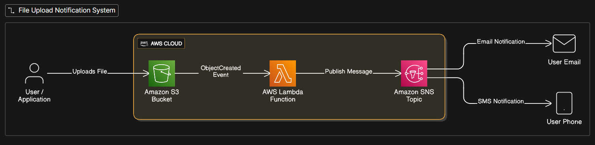
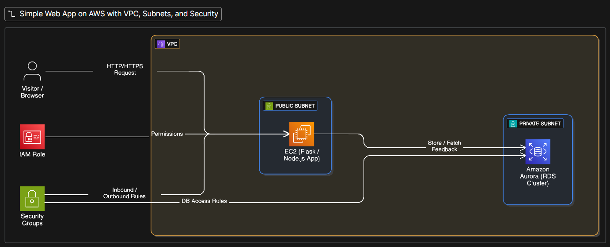
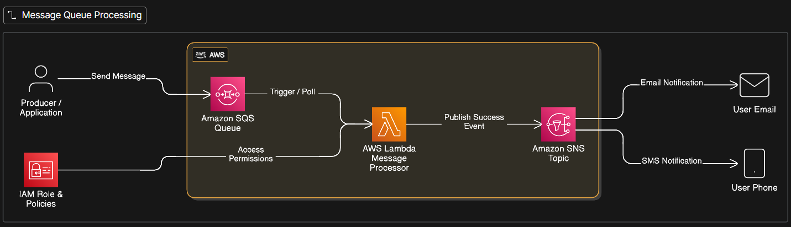
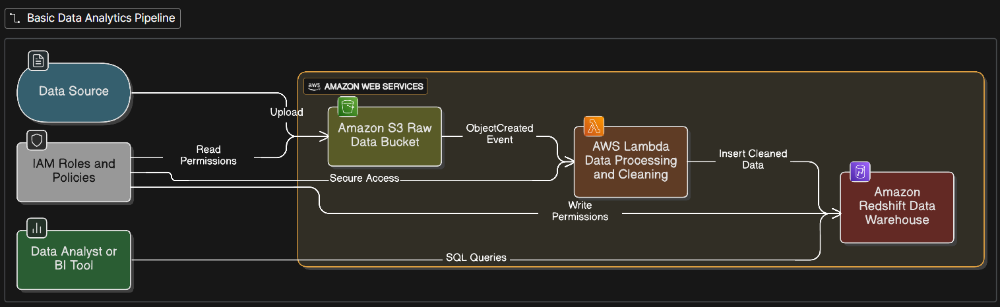

# AWS Cloud Architecture Projects: Serverless, Scalable, and Event-Driven Systems

## **Project 1: File Upload & Notification System**
**Description:**
 Developed a serverless file upload monitoring system using **Amazon S3, AWS Lambda, Amazon SNS, and IAM**. The system automatically detects file uploads and notifies users in real time.

**Components Used:**

- Amazon S3 (file storage)
- AWS Lambda (event processing)
- Amazon SNS (email/SMS notifications)
- IAM (access control)
**Workflow / Steps:**

1. A user or application uploads a file to an S3 bucket.
2. An **S3 ObjectCreated event** triggers the Lambda function.
3. The Lambda function processes the event metadata (file name, timestamp, bucket).
4. Lambda publishes a message to an SNS topic.
5. SNS sends notifications to subscribed users via email or SMS.
**Outcome:**
 Provides instant alerts for file uploads using a scalable, cost-effective, serverless architecture.

    
*Fig 1: File Upload & Notification System Architecture*
---

## **Project 2: Simple Web Server with Database**
**Description:**
 Built a secure web-based feedback collection system using **Amazon EC2, Amazon Aurora (RDS), VPC, IAM, and Security Groups**. The application runs inside a VPC with proper subnet isolation to ensure data privacy.

**Components Used:**

- Amazon EC2 (web application server)
- Amazon Aurora (RDS) (database)
- Amazon VPC (network isolation)
- Public and Private Subnets
- IAM roles & Security Groups
**Workflow / Steps:**

1. A user accesses the web application through a browser.
2. The request reaches the EC2 instance hosted in a **public subnet**.
3. The web application processes the input (feedback form).
4. Feedback data is securely stored in **Aurora (RDS)** located in a **private subnet**.
5. Security groups allow only EC2-to-database communication.
**Outcome:**
 Ensures secure data storage, controlled network access, and forms the foundation for scalable web applications.

    
*Fig 2: Simple Web Server with Database*

---

## **Project 3: Message Queue Processing System**
**Description:**
 Implemented an asynchronous, event-driven processing system using **Amazon SQS, AWS Lambda, Amazon SNS, and IAM**, enabling reliable background task execution with user notifications.

**Components Used:**

- Amazon SQS (message queue)
- AWS Lambda (message processor)
- Amazon SNS (notification service)
- IAM (permissions management)
**Workflow / Steps:**

1. A producer application sends messages to an SQS queue.
2. Lambda continuously polls the queue for new messages.
3. Each message is processed independently by Lambda.
4. Upon successful processing, Lambda publishes a notification to SNS.
5. SNS sends status updates to users via email or SMS.
**Outcome:**
 Provides fault-tolerant, decoupled message processing suitable for background jobs and microservices.

    
*Fig 3: Message Queue Processing System*

---

## **Project 4: Basic Data Analytics Pipeline**
**Description:**
 Designed a simple data ingestion and analytics pipeline using **Amazon S3, AWS Lambda, Amazon Redshift, and IAM**, enabling automated data processing and SQL-based analytics.

**Components Used:**

- Amazon S3 (raw data storage)
- AWS Lambda (data cleaning & transformation)
- Amazon Redshift (data warehouse)
- IAM roles (secure service integration)
**Workflow / Steps:**

1. Raw CSV files are uploaded to an S3 bucket.
2. An S3 event triggers the Lambda function.
3. Lambda cleans, transforms, and validates the data.
4. Processed data is loaded into Amazon Redshift.
5. Analysts run SQL queries on Redshift to generate insights.
**Outcome:**
 Automates data ingestion and analytics, providing hands-on experience with AWS data engineering workflows.

    
*Fig 4: Basic Data Analytics Pipeline*
